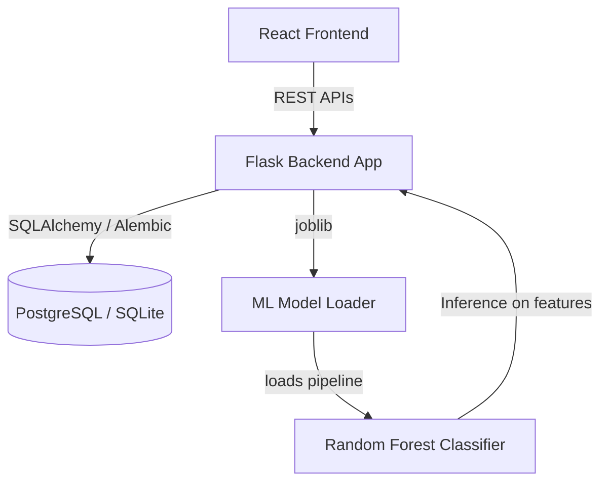

# Credit Risk Assessment System

A full-stack predictive underwriting application that evaluates loan applications. The system leverages a custom machine learning pipeline to estimate default probability and passes outputs through a business rule engine to automate credit approval, calculate expected loss, and classify risk.

Live Demo (Frontend): [Render Link](https://credit-risk-frontend-akjw.onrender.com)  
API Endpoint (Backend): [Render Link](https://credit-risk-app-vwc5.onrender.com)

---

## System Architecture



### Tech Stack
* **Frontend**: React (Vite, custom Vanilla CSS)
* **Backend**: Flask (Application Factory pattern, Blueprints)
* **Database**: PostgreSQL (Production) / SQLite (Local development)
* **Migrations**: Alembic (via Flask-Migrate)
* **Machine Learning**: Scikit-Learn (Pipelines, Custom Transformers, Joblib)

---

## Machine Learning & Feature Engineering

Instead of running inference on raw data, the pipeline uses a custom preprocessing and engineering flow to maximize predictive accuracy:

### 1. Feature Engineering
Before training or inference, raw fields are processed by a custom `FeatureEngineer` transformer to create domain-specific features:
* **Debt-to-Income Ratio** (`loan_income_ratio`): `loan_amnt / person_income`
* **Credit Maturity Ratio** (`cred_hist_to_age_ratio`): `cb_person_cred_hist_length / person_age`
* **Interest Rate Risk Interaction** (`rate_x_loan`): `loan_int_rate * loan_amnt`
* **Employment Stability Category** (`emp_stability`): `low` (< 2 years), `mid` (< 5 years), or `high` (>= 5 years)

### 2. Model Pipeline & Tuning
* **Model**: A `RandomForestClassifier` with balanced class weights.
* **Optimization**: To handle class imbalance, the training script runs a grid search on the classification boundary to maximize the F1-score, resulting in an optimal decision threshold of **`0.4`**.
* **Preprocessors**: `StandardScaler` for numerical columns and `OneHotEncoder` / `OrdinalEncoder` (for loan grades) are serialized directly inside the Scikit-learn Pipeline artifact to prevent data leakage.

---

## Business Rules & Separation of Concerns

To ensure auditability and flexibility, statistical ML predictions are separated from underwriting policy decisions:
* **Statistical Inference**: The model outputs a raw default probability.
* **Expected Loss (EL) Calculation**: The backend computes expected loss as:
  $$EL = \text{Default Probability} \times \text{Loss Given Default (0.4)} \times \text{Loan Amount}$$
* **Underwriting Policy**:
  * **Approve**: If default probability $\le 0.4$ AND Expected Loss $\le \$10,000$.
  * **Reject**: If default probability $> 0.4$ OR Expected Loss $> \$10,000$.

---

## Relational Database & Analytics Layer

The database schema maps application history and prediction logs. To optimize performance, the system uses database-level views for the analytical dashboard:
1. `v_default_rate_by_intent`: Aggregate default rates grouped by loan intent.
2. `v_loss_by_grade`: Average expected losses grouped by credit grade (A-G).
3. `v_loan_amount_by_grade`: Distribution of request size across credit grades.

Database schemas and views are deployed and tracked using **Alembic migrations**.

---

## Getting Started

### Prerequisites
* Python 3.10+
* Node.js 18+

### Installation & Local Setup

1. **Clone the Repository**
   ```bash
   git clone https://github.com/jcho0072/credit-risk-app
   cd credit-risk-app
   ```

2. **Configure Backend**
   ```bash
   cd backend
   python -m venv venv
   source venv/bin/activate  # On Windows: venv\Scripts\activate
   pip install -r requirements.txt
   ```
   Create a `.env` file in the `backend/` directory:
   ```env
   DATABASE_URL=sqlite:///app.db
   MODEL_PATH=app/inference/model.pkl
   ```

3. **Initialize Database**
   ```bash
   flask db upgrade
   ```

4. **Run Backend Service**
   ```bash
   python -m backend.app.main
   ```
   The backend will run on `http://localhost:5000`.

5. **Configure & Run Frontend**
   ```bash
   cd ../frontend
   npm install
   npm run dev
   ```
   Open `http://localhost:5173` in your browser.
