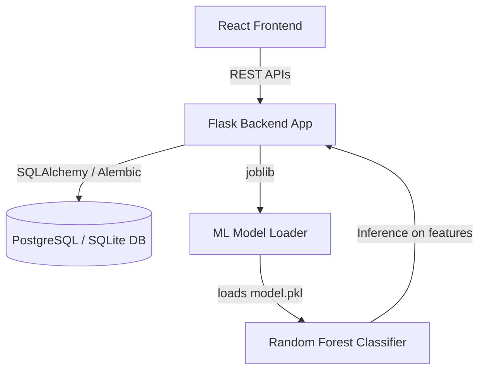
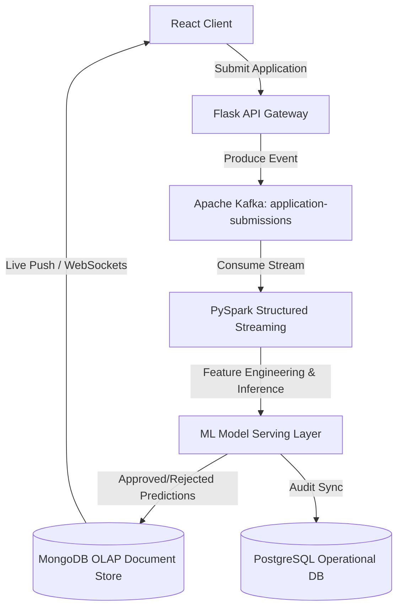

# Credit Risk Assessment System: Project Overview

This document provides a comprehensive overview of the **Credit Risk Assessment System**, its current development state, architecture, database schemas, machine learning pipeline, and core business logic.

---

## 1. Project Purpose & Features

The **Credit Risk Assessment System** is a full-stack web application designed to help lending institutions evaluate loan applications. It achieves this by combining a machine learning model (trained on credit datasets) with a business logic rule layering system to compute key credit metrics.

### Key Features
- **Application Management (CRUD)**: Create, read, update, and delete loan applications.
- **Predictive Analytics**: A Machine Learning model predicts the probability of an applicant defaulting on their loan.
- **Business Rule Layer**: Separates raw statistical default probability from actual business choices (e.g. loan approval/rejection, expected loss, and risk status).
- **Credit Analytics Dashboard**: Visualizations of credit metrics such as default rates by loan intent, losses by grade, and average loan amounts by grade.
- **Database Persistence**: Relational persistence for applications, prediction logs, and analytical aggregates.

---

## 2. System Architecture

The application is split into a **Frontend (React)** and a **Backend (Flask)**, with an **ML training pipeline** and a **relational database**.

### Tech Stack
- **Frontend**: React (Vite-based application) using Vanilla CSS for custom interfaces and styling.
- **Backend**: Flask application using the Application Factory pattern.
- **Database**: PostgreSQL (Production hosted on Render) / SQLite (Local development).
- **ML Engine**: Scikit-Learn (Random Forest Classifier, pipelines, pipelines/custom transformer).

---

## 3. Directory Structure & Key Files

Here are the key modules and directories of the project:

- **[`README.md`](file:///D:/2026_internship/whtvr_i_need/credit-risk-app/README.md)**: Main setup and project overview.
- **[`TODO.md`](file:///D:/2026_internship/whtvr_i_need/credit-risk-app/TODO.md)**: Project roadmap tracking completed and remaining tasks.
- **`backend/`**: Contains the API server code:
  - **[`backend/app/__init__.py`](file:///D:/2026_internship/whtvr_i_need/credit-risk-app/backend/app/__init__.py)**: Configures and initializes Flask, extensions, blueprints, and CLI commands.
  - **[`backend/app/models/loan_applications.py`](file:///D:/2026_internship/whtvr_i_need/credit-risk-app/backend/app/models/loan_applications.py)**: SQLAlchemy model mapping loan application attributes and output prediction variables to the database.
  - **[`backend/app/routes/applications.py`](file:///D:/2026_internship/whtvr_i_need/credit-risk-app/backend/app/routes/applications.py)**: REST endpoints for loan applications CRUD.
  - **[`backend/app/routes/analytics.py`](file:///D:/2026_internship/whtvr_i_need/credit-risk-app/backend/app/routes/analytics.py)**: REST endpoints for analytics querying database views.
  - **[`backend/app/services/prediction_service.py`](file:///D:/2026_internship/whtvr_i_need/credit-risk-app/backend/app/services/prediction_service.py)**: Intermediary service that constructs dataframes, executes inference, and applies business rules.
  - **[`backend/app/inference/model_loader.py`](file:///D:/2026_internship/whtvr_i_need/credit-risk-app/backend/app/inference/model_loader.py)**: Unpickles and caches the ML model file using `joblib`.
  - **[`backend/app/validators/application_validator.py`](file:///D:/2026_internship/whtvr_i_need/credit-risk-app/backend/app/validators/application_validator.py)**: Validation logic for user-entered fields (bounds checking and types).
- **`frontend/`**: The React UI:
  - **[`frontend/src/pages/CreditPage.jsx`](file:///D:/2026_internship/whtvr_i_need/credit-risk-app/frontend/src/pages/CreditPage.jsx)**: Main loan application management page.
  - **[`frontend/src/pages/AnalyticsDashboard.jsx`](file:///D:/2026_internship/whtvr_i_need/credit-risk-app/frontend/src/pages/AnalyticsDashboard.jsx)**: Dashboard page containing visualizations.
  - **[`frontend/src/hooks/useApplications.jsx`](file:///D:/2026_internship/whtvr_i_need/credit-risk-app/frontend/src/hooks/useApplications.jsx)** & **[`frontend/src/hooks/useAnalytics.jsx`](file:///D:/2026_internship/whtvr_i_need/credit-risk-app/frontend/src/hooks/useAnalytics.jsx)**: Custom hooks managing API calls and component states.
- **`ml/`**: Machine Learning scripts:
  - **[`ml/train_model.py`](file:///D:/2026_internship/whtvr_i_need/credit-risk-app/ml/train_model.py)**: Machine learning pipeline that processes features, trains a Random Forest Classifier, searches for optimal F1-score threshold, and serializes the model.
- **`shared/`**:
  - **[`shared/feature_engineering.py`](file:///D:/2026_internship/whtvr_i_need/credit-risk-app/shared/feature_engineering.py)**: A Scikit-learn transformer class (`FeatureEngineer`) utilized during model training and backend inference to engineer custom ratios from raw features.

---

## 4. Machine Learning Pipeline & Feature Engineering

The ML model (`model.pkl`) is loaded at startup to perform predictions.

### Engineered Features
Before running predictions, the pipeline creates secondary features in [`shared/feature_engineering.py`](file:///D:/2026_internship/whtvr_i_need/credit-risk-app/shared/feature_engineering.py):
1. **Debt-to-Income Ratio** (`loan_income_ratio`): $\text{loan\_amnt} / \text{person\_income}$
2. **Income per Employment Year** (`income_per_emp_year`): $\text{person\_income} / (\text{person\_emp\_length} + 1)$
3. **Credit Maturity Ratio** (`cred_hist_to_age_ratio`): $\text{cb\_person\_cred\_hist\_length} / \text{person\_age}$
4. **Interest Rate Risk Interaction** (`rate_x_loan`): $\text{loan\_int\_rate} \times \text{loan\_amnt}$
5. **Employee Stability** (`emp_stability`): Categorical label (`low` < 2 years, `mid` < 5 years, `high` >= 5 years).
6. **Employee Length-to-Age Ratio** (`emp_length_ratio`): $\text{person\_emp\_length} / \text{person\_age}$

### Model & Training
- The model is a **Random Forest Classifier** configured with `max_depth=5` and `class_weight='balanced'`.
- It processes numerical variables using a `StandardScaler` (after imputing missing values with the mean).
- Categorical features are encoded using `OneHotEncoder` or `OrdinalEncoder` (specifically for `loan_grade`).
- The training script finds the optimal decision threshold (by maximizing the F1 score on testing data) and serializes the pipeline along with the chosen threshold. The threshold is set to `0.4` in the pickled bundle.

---

## 5. Decision Rules & Business Logic

Rather than directly outputting the classifier's class selection, the backend uses a dedicated service layer ([`backend/app/services/prediction_service.py`](file:///D:/2026_internship/whtvr_i_need/credit-risk-app/backend/app/services/prediction_service.py)) to map probabilities to decisions:

- **Threshold check**: An application probability exceeding the threshold (`0.4`) signifies high default risk.
- **Expected Loss (EL)**: Computed as:
  $$EL = \text{Default Probability} \times \text{Loss Given Default (LGD)} \times \text{Loan Amount}$$
  *(Here, Loss Given Default is assumed to equal the threshold `0.4`).*
- **Final Decision**:
  - **Reject** if the probability is greater than `0.4` **OR** the Expected Loss is greater than `$10,000`.
  - **Approve** otherwise.
- **Risk Status**:
  - **High Risk** if probability > `0.4`.
  - **Low Risk** if probability <= `0.4`.

---

## 6. Database Views & Analytics Schema

The database leverages three key views for high-performance aggregate reporting in the React dashboard:

1. **Default Rate by Intent** (`v_default_rate_by_intent`):
   Summarizes application counts, average loan amounts, and average predicted default probabilities grouped by loan categories (e.g. personal, education, medical).
2. **Loss by Grade** (`v_loss_by_grade`):
   Calculates average expected loss grouped by loan credit grade (A through G).
3. **Loan Amount by Grade** (`v_loan_amount_by_grade`):
   Aggregates average loan amount request size grouped by loan credit grade.

These views were deployed to the database using an Alembic migration script ([`migrations/versions/e721267c7df4_create_views.py`](file:///D:/2026_internship/whtvr_i_need/credit-risk-app/migrations/versions/e721267c7df4_create_views.py)).

---

## 7. Current Project State & Roadmap

Based on the [`TODO.md`](file:///D:/2026_internship/whtvr_i_need/credit-risk-app/TODO.md) file, here is the current state:

### Completed
- **Structural Refactoring**: Transitioned backend to Flask blueprint architecture and created extensions/app factory modules.
- **Database Schema**: Renamed model/table references to align with frontend snapshots (`LoanApplications`, `application_id` instead of person). Cleaned up legacy DB files and initialized migrations using `Flask-Migrate`.
- **Database Views**: Implemented Alembic scripts to deploy analytics views.
- **Expose Analytics Endpoints**: Registered `/analytics/loss-by-grade`, `/analytics/default-rate-by-intent`, and `/analytics/loan-amount-by-grade` endpoints on the backend blueprint.
- **Bulk Ingestion Script**: Developed the `flask ingest-data` CLI command inside `backend/app/commands.py` to parse CSVs, execute inference in parallel, and bulk insert rows in chunks using SQLAlchemy mappings.
- **Frontend Dashboard Wiring**: Built aggregate widgets (`DefaultRateByIntentWidget`, `LossByGradeWidget`, `LoanAmountByGradeWidget`) and structured them inside the responsive CSS dashboard grid.

### Next Tasks (Pending)
1. **Security**: Restrict or disable the `/debug-db` route in production environments.
2. **Data Validation Constraints**: Implement database-level check constraints (e.g., `age >= 18`, `income >= 0`) matching python-level validations in migration files.
3. **Environment Setup**: Create a `.env.example` file to standardize local setups.
4. **Testing**: Build API tests covering CRUD operations and ML prediction validation using `pytest`.

---

## 8. Proposed Enterprise Scale Architecture (Event-Driven Pipeline)

To scale the Credit Risk Assessment System for enterprise workloads (e.g., millions of loan queries per hour), the architecture can be evolved from a synchronous request-response flow to an asynchronous event-driven streaming pipeline.

### Architectural Diagram

### Key Scaling Mechanisms
1. **Real-Time Event Ingestion (Apache Kafka):** 
   User submissions immediately write to a Kafka topic (`application-submissions`). This decouples the client from database operations, preventing frontend lockups during traffic spikes.
2. **Stream Processing (Apache Spark Structured Streaming):**
   PySpark consumes the submission stream in real-time, executing feature engineering and ML model predictions in vectorized batches (e.g. predicting thousands of rows in a single pass) instead of synchronous single-row loops.
3. **Idempotent Document Storage (MongoDB):**
   Audit logs and predictions are written to MongoDB. By defining a compound unique index on `{applicant_id, application_date}`, the database uses upsert writes (with `$addToSet`) to handle network retries or message re-deliveries without creating duplicate records.
4. **Push-Based Visualizations (WebSockets):**
   Instead of the frontend polling endpoints for dashboard data, changes in the analytical aggregates are pushed directly to the React UI in real-time using WebSockets, creating a live-updating credit risk dashboard.
